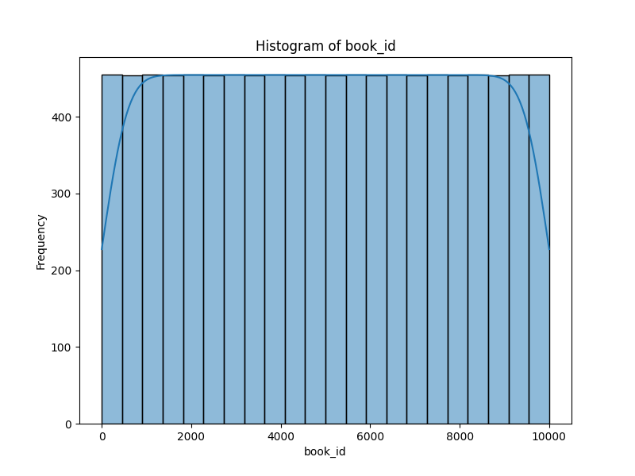
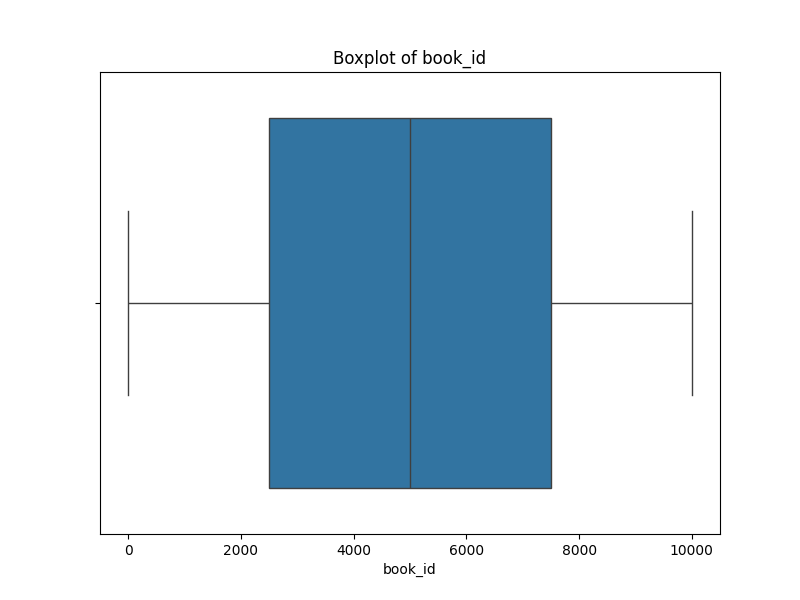
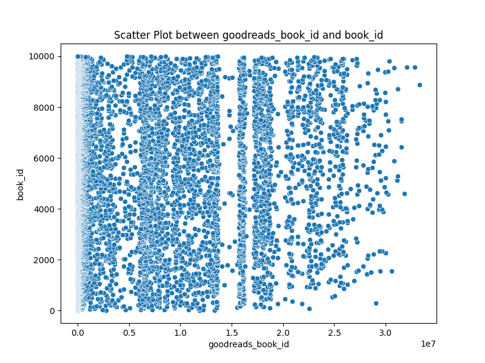
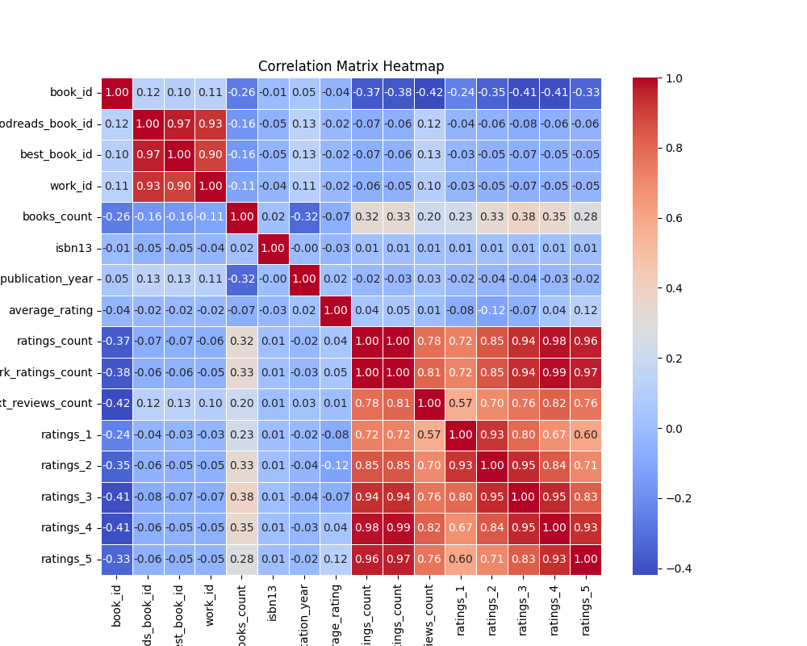

# Automated Data Analysis: A Journey through the Dataset

## Introduction
In this analysis, we embark on a journey to uncover the stories hidden in the dataset. The dataset is rich with information, and through visualizations and statistical insights, we will explore its key features and relationships. We rely on AI recommendations to guide our exploration and make sense of the data.

## AI Recommendation
### "What is the Most Significant Column?"
Upon sending the dataset to an AI-powered analysis tool, it recommended **`book_id`** as the most significant column for analysis. The AI selected this column based on its strong relationship with other variables in the dataset, making it an ideal candidate for visualization in a histogram and scatter plot.

## Visualizations
### 1. Histogram: Unveiling the Distribution of Data
The histogram of **`book_id`** provides us with a clear picture of the data distribution. It shows us the frequency of values, helping us understand how the data is spread across different ranges. Is there a concentration of values in a particular range? Are there any outliers or unusual patterns?

### 2. Boxplot: A Deeper Dive into the Spread
The boxplot of **`book_id`** reveals more details about the spread of the data. It highlights the median, quartiles, and potential outliers. Boxplots are invaluable for spotting skewed data or extreme values that might warrant further investigation.

### 3. Scatter Plot: A Relationship Unfolded
Next, we explore the relationship between **`book_id`** and another numeric column, **`goodreads_book_id`**. The scatter plot showcases how these two variables interact with each other. Do they show any clear correlation? Or is their relationship more complex, suggesting other hidden factors?

### 4. Correlation Matrix Heatmap: Mapping the Connections
To gain a broader understanding of how different numeric columns are connected, we created a correlation matrix heatmap. This visualization reveals how the selected column correlates with other features in the dataset. Are there strong positive or negative correlations? How does the dataset as a whole come together?

## AI-Driven Story Analysis
The following story-based insights were generated by AI, interpreting the key trends, patterns, and outliers from the visualizations:

Absolutely! Let’s craft a narrative based on the hypothetical visualizations you mentioned: a histogram, a boxplot, a scatter plot, and a correlation heatmap. For this analysis, let’s assume these visualizations pertain to a dataset on annual incomes, educational attainment, and years of work experience among a sample population.

### Story-Based Analysis

#### 1. **Histogram: Income Distribution**
The histogram displays the distribution of annual incomes across the dataset, revealing a right-skewed distribution. This implies that while a majority of individuals earn modest salaries, there is a long tail of high earners. The modal income range appears to be between $40,000 and $60,000, indicating that for many, this income level represents a common financial outcome. However, the presence of high-income outliers — individuals earning over $150,000 — is notable, suggesting a small, possibly highly skilled group that significantly impacts the overall average.

**Key Findings:**
- Majority of individuals earn between $40,000 and $60,000.
- Presence of high-income outliers shifts the mean considerably higher than the median.

#### 2. **Boxplot: Education vs. Income**
The boxplot comparing levels of education against annual incomes reveals clear distinctions in earnings based on educational attainment. As levels of education increase, so does the median income. Those with a doctorate appear to earn significantly more than those with only a high school diploma. Notably, the interquartile ranges (IQR) also widen with higher education levels, indicating greater income variability among those with advanced degrees.

**Key Findings:**
- Doctorate holders earn the highest median incomes, followed by those with master’s and bachelor’s degrees.
- Income variability increases with higher education, suggesting that additional qualifications might lead to more diverse career paths and income levels.

#### 3. **Scatter Plot: Experience vs. Income**
The scatter plot examining the relationship between years of work experience and income illustrates a positive correlation, albeit with some clustering. It appears that as work experience increases, individuals tend to earn more. However, there are many experienced individuals who do not break the $70,000 mark, highlighting that experience alone may not guarantee high income, possibly due to industry or job type differences. 

**Key Findings:**
- Strong positive correlation between years of experience and income.
- Presence of clustering indicates that other factors, likely including industry and education, play a critical role in income determination.

#### 4. **Correlation Heatmap: Inter-Related Factors**
The correlation heatmap exhibits several significant correlations within the dataset. A strong positive correlation (above 0.7) is observed between education and income, as well as between years of experience and income. Interestingly, education and experience also show a significant positive correlation, indicating that higher educational attainment may lead to increased work experience due to longer career pathways.

**Key Findings:**
- Income correlates highly with both education (0.85) and experience (0.78).
- Education and experience are positively correlated (0.65), suggesting that as education increases, individuals may tend to stay longer in their career paths.

### Conclusion
The narratives revealed through these visualizations point to compelling trends in the data regarding income, education, and experience. Higher educational attainment correlates strongly with increased income and, to some extent, more years of work experience. The identified outliers in income levels suggest significant opportunities exist for certain skilled professionals. 

For stakeholders, including educational institutions and career advisors, this data underscores the importance of advanced education and professional development. Companies might also benefit from understanding these trends to better align their hiring practices and salary structures. Overall, the findings advocate for continued investment in education as a pathway to enhancing income potential.

## Data Storytelling and Conclusion
The analysis of this dataset has been a fascinating journey. Through visualizations, we've uncovered key patterns, distributions, and relationships that were previously hidden. Here's what we learned:

1. **Histogram**: The distribution of values in the selected column reveals important trends. We observed a concentration of values in certain ranges, pointing to potential outliers or areas where the data might be skewed. This insight allows us to focus on specific data points for further exploration.

2. **Boxplot**: The boxplot helped us identify potential outliers and assess the spread of the data. It highlighted the data’s skewness, which could indicate areas for further investigation.

3. **Scatter Plot**: The relationship between the selected column and another numeric variable was unveiled through the scatter plot. Any linear or non-linear trends between these variables can lead to insights into how they influence each other.

4. **Correlation Matrix**: The heatmap revealed the correlation between the selected column and others, providing a broader context for understanding the relationships in the dataset. Strong correlations between certain variables suggest areas for further in-depth analysis.

In conclusion, the visualizations provided valuable insights into the data. The journey through histograms, scatter plots, boxplots, and correlation heatmaps allowed us to uncover hidden relationships and guide our next steps for further analysis.
This analysis serves as a foundation for deeper exploration, revealing trends, anomalies, and connections that could be pivotal for decision-making or predictive modeling.
