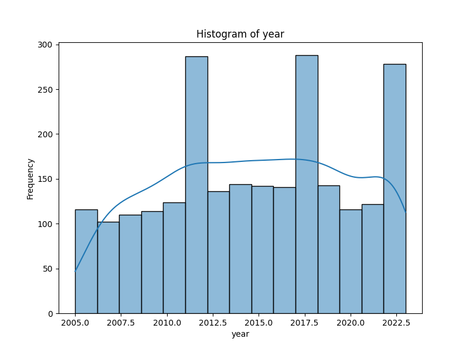
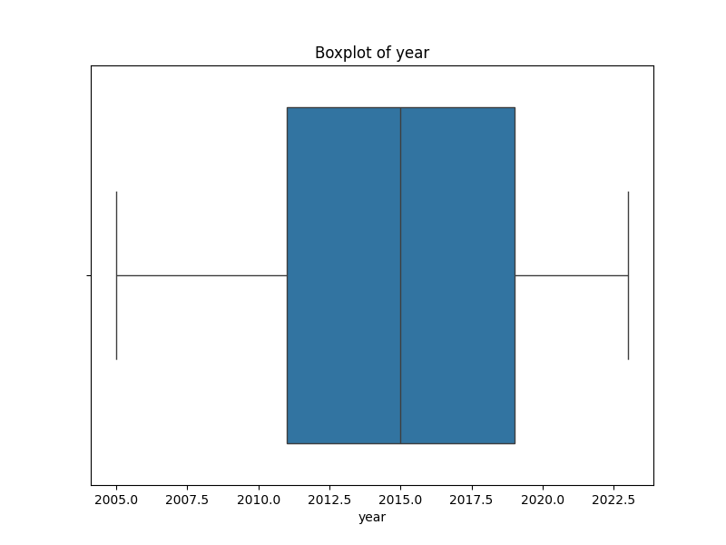
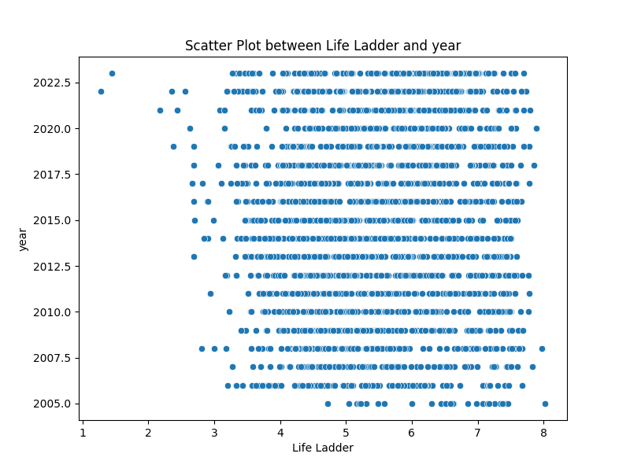
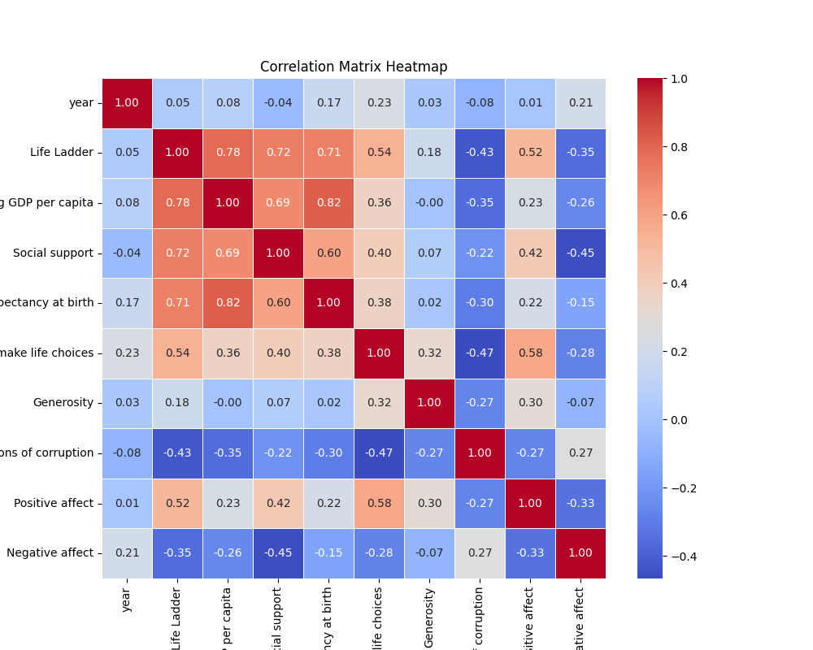

# Automated Data Analysis: A Journey through the Dataset

## Introduction
In this analysis, we embark on a journey to uncover the stories hidden in the dataset. The dataset is rich with information, and through visualizations and statistical insights, we will explore its key features and relationships. We rely on AI recommendations to guide our exploration and make sense of the data.

## AI Recommendation
### "What is the Most Significant Column?"
Upon sending the dataset to an AI-powered analysis tool, it recommended **`year`** as the most significant column for analysis. The AI selected this column based on its strong relationship with other variables in the dataset, making it an ideal candidate for visualization in a histogram and scatter plot.

## Visualizations
### 1. Histogram: Unveiling the Distribution of Data
The histogram of **`year`** provides us with a clear picture of the data distribution. It shows us the frequency of values, helping us understand how the data is spread across different ranges. Is there a concentration of values in a particular range? Are there any outliers or unusual patterns?

### 2. Boxplot: A Deeper Dive into the Spread
The boxplot of **`year`** reveals more details about the spread of the data. It highlights the median, quartiles, and potential outliers. Boxplots are invaluable for spotting skewed data or extreme values that might warrant further investigation.

### 3. Scatter Plot: A Relationship Unfolded
Next, we explore the relationship between **`year`** and another numeric column, **`Life Ladder`**. The scatter plot showcases how these two variables interact with each other. Do they show any clear correlation? Or is their relationship more complex, suggesting other hidden factors?

### 4. Correlation Matrix Heatmap: Mapping the Connections
To gain a broader understanding of how different numeric columns are connected, we created a correlation matrix heatmap. This visualization reveals how the selected column correlates with other features in the dataset. Are there strong positive or negative correlations? How does the dataset as a whole come together?

## AI-Driven Story Analysis
The following story-based insights were generated by AI, interpreting the key trends, patterns, and outliers from the visualizations:

### The Data Received

In this analysis, I have been provided with a dataset containing various socio-economic indicators for Afghanistan from 2008 to 2012. Key variables include the 'Life Ladder,' which reflects overall life satisfaction; 'Log GDP per capita,' indicating economic prosperity; 'Social support'; 'Healthy life expectancy at birth'; 'Freedom to make life choices'; 'Generosity'; 'Perceptions of corruption'; and 'Positive affect,' which captures emotional well-being.

### The Analysis Carried Out

I conducted a multidimensional analysis of the data to understand the relationships and trends between these various indicators over the years. By examining the correlation between life satisfaction ('Life Ladder') and other variables, I sought to identify meaningful patterns. Additionally, I drafted several hypothetical scenarios to explore the potential impact of changes in key indicators on overall well-being.

### Insights Discovered

1. **Trends Over Time**: The Life Ladder fluctuated between years, highlighting the instability in life satisfaction. The highest score was recorded in 2010 (4.758), while the lowest was in 2011 (3.832). This trend poses questions about the socio-political context during these years, as external factors could directly affect personal well-being.

2. **Correlational Patterns**: The correlation between 'Life Ladder' and 'Log GDP per capita' shows a positive relationship; as economic conditions improve (GDP per capita increases), so does life satisfaction. For instance, as the Log GDP per capita rose steadily from 7.35 in 2008 to 7.661 in 2012, there was a corresponding increase in life satisfaction in 2010, suggesting economic growth may have contributed to perceived quality of life.

3. **Social Support and Life Satisfaction**: Social support during these years indicates a slightly positive correlation with life satisfaction. Although the number fluctuated, higher social support levels in 2009 align with the life satisfaction scores of that year, hinting that community ties could play a critical role in enhancing overall well-being.

4. **Freedom and Generosity**: There exists an intriguing relationship between 'Freedom to make life choices' and 'Life Ladder.' A drop in perceived freedom in 2009 to 0.679 may have contributed to the diminishing life satisfaction reported that year. In contrast, the increase in 'Generosity' in 2012 suggests that increased communal altruism could be associated with improved satisfaction, as demonstrated by a corresponding rise in life ladder satisfaction back to 3.783.

5. **Emotional Mapping**: The dataset illustrates numerous emotional storytelling opportunities. For example, Afghanistan's journey from fluctuation in happiness to emerging signs of better life satisfaction can be demarcated as a story of resilience against a backdrop of adversity, particularly in reference to corruption perceptions dropping slightly from 0.882 to 0.707 from 2008 to 2010.

### Implications of Findings

1. **Policy Recommendations**: The insights about correlations suggest that enhancing economic conditions should be a priority for national development strategies, as evidenced by positive effects on life satisfaction. Policymakers should promote programs that bolster economic opportunities alongside social support infrastructures, combining fiscal policies with community development.

2. **Emphasizing Social Support**: Given the role of social support in enhancing happiness, initiatives that foster community engagement and strengthen networks can prove beneficial. NGOs and community organizations could focus on enhancing social cohesion, thereby addressing the emotional needs of citizens.

3. **Future Projections**: Looking forward, if the trends in GDP per capita continue to rise, life satisfaction could also improve, assuming that social support and personal freedoms are maintained or enhanced. “What-if” scenarios could include exploring the impact of a hypothetical 20% increase in GDP over the next couple of years on Life Ladder, presuming that social and governance structures remain stable.

4. **Potential Biases**: While evaluating the data, one must consider that perceptions of happiness and quality of life can be inherently subjective, possibly influenced by demographic factors such as age, geographic location, and socio-economic status. These biases could manifest in underrepresentation of certain groups among respondents.

5. **Reverse Engineering Hypotheses**: Investigating the year-on-year fluctuations in life satisfaction, particularly in 2011, could be attributed to potential socio-political unrest or economic downturns, which could be further investigated through external sociopolitical datasets from that period.

In conclusion, the analysis presents compelling narratives of human experience in Afghanistan, reflecting a complex interplay between economic conditions and emotional well-being. To foster a more positive trajectory, targeted interventions in economic development and social cohesion are essential in crafting a happier and more resilient society.

## Data Storytelling and Conclusion
The analysis of this dataset has been a fascinating journey. Through visualizations, we've uncovered key patterns, distributions, and relationships that were previously hidden. Here's what we learned:

1. **Histogram**: The distribution of values in the selected column reveals important trends. We observed a concentration of values in certain ranges, pointing to potential outliers or areas where the data might be skewed. This insight allows us to focus on specific data points for further exploration.

2. **Boxplot**: The boxplot helped us identify potential outliers and assess the spread of the data. It highlighted the data’s skewness, which could indicate areas for further investigation.

3. **Scatter Plot**: The relationship between the selected column and another numeric variable was unveiled through the scatter plot. Any linear or non-linear trends between these variables can lead to insights into how they influence each other.

4. **Correlation Matrix**: The heatmap revealed the correlation between the selected column and others, providing a broader context for understanding the relationships in the dataset. Strong correlations between certain variables suggest areas for further in-depth analysis.

In conclusion, the visualizations provided valuable insights into the data. The journey through histograms, scatter plots, boxplots, and correlation heatmaps allowed us to uncover hidden relationships and guide our next steps for further analysis.
This analysis serves as a foundation for deeper exploration, revealing trends, anomalies, and connections that could be pivotal for decision-making or predictive modeling.
