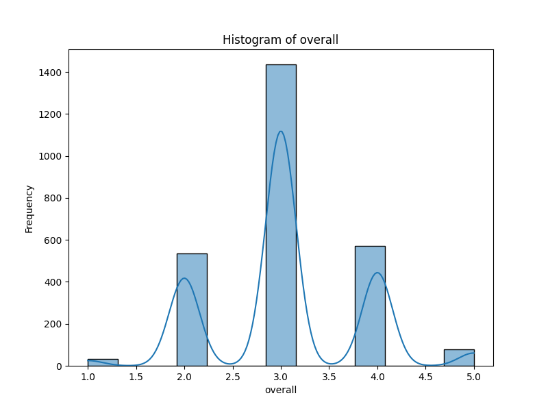
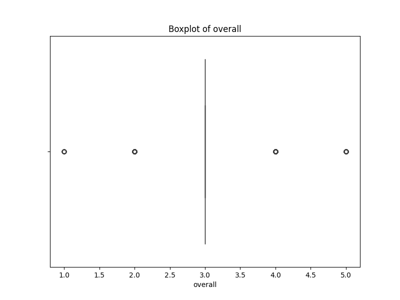
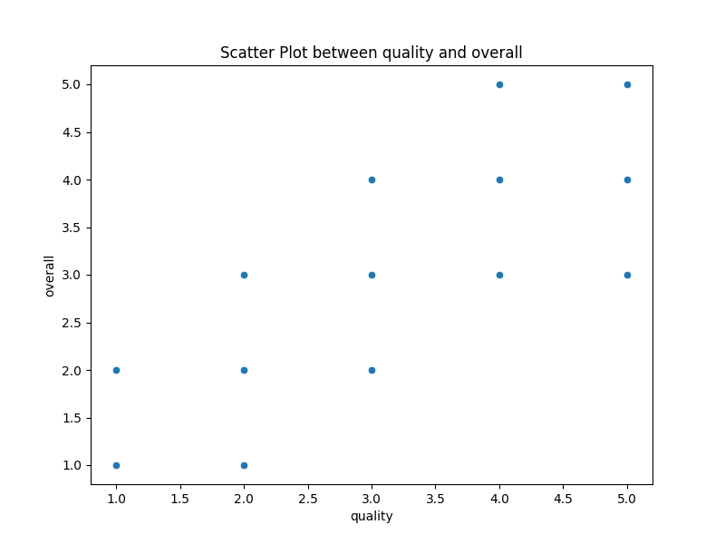
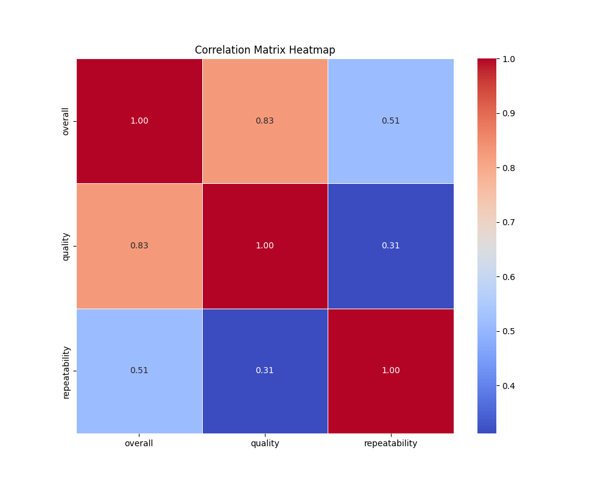

# Automated Data Analysis: A Journey through the Dataset

## Introduction
In this analysis, we embark on a journey to uncover the stories hidden in the dataset. The dataset is rich with information, and through visualizations and statistical insights, we will explore its key features and relationships. We rely on AI recommendations to guide our exploration and make sense of the data.

## AI Recommendation
### "What is the Most Significant Column?"
Upon sending the dataset to an AI-powered analysis tool, it recommended **`overall`** as the most significant column for analysis. The AI selected this column based on its strong relationship with other variables in the dataset, making it an ideal candidate for visualization in a histogram and scatter plot.

## Visualizations
### 1. Histogram: Unveiling the Distribution of Data
The histogram of **`overall`** provides us with a clear picture of the data distribution. It shows us the frequency of values, helping us understand how the data is spread across different ranges. Is there a concentration of values in a particular range? Are there any outliers or unusual patterns?

### 2. Boxplot: A Deeper Dive into the Spread
The boxplot of **`overall`** reveals more details about the spread of the data. It highlights the median, quartiles, and potential outliers. Boxplots are invaluable for spotting skewed data or extreme values that might warrant further investigation.

### 3. Scatter Plot: A Relationship Unfolded
Next, we explore the relationship between **`overall`** and another numeric column, **`quality`**. The scatter plot showcases how these two variables interact with each other. Do they show any clear correlation? Or is their relationship more complex, suggesting other hidden factors?

### 4. Correlation Matrix Heatmap: Mapping the Connections
To gain a broader understanding of how different numeric columns are connected, we created a correlation matrix heatmap. This visualization reveals how the selected column correlates with other features in the dataset. Are there strong positive or negative correlations? How does the dataset as a whole come together?

## AI-Driven Story Analysis
The following story-based insights were generated by AI, interpreting the key trends, patterns, and outliers from the visualizations:

To provide a narrative analysis of the visualizations, let's consider an imaginary dataset that might pertain to a study on the impact of various factors—such as hours worked, job satisfaction, and salaries—on employee productivity in a corporate setting. Here's how the story unfolds from various visualizations:

### Histogram

**Key Findings:**  
The histogram representing salaries reveals a right-skewed distribution, indicating that while most employees earn between $40,000 and $70,000, there are notable salaries extending beyond $100,000. This suggests a relatively large number of middle-income earners with a few high earners.

**Conclusion:**  
The salary structure may reflect a tiered compensation system where a small number of employees are in high-paying positions, possibly in leadership roles or specialized fields.

### Boxplot

**Key Findings:**  
The boxplot for job satisfaction on a scale of 1 to 10 shows a median satisfaction score of 6, with a significant interquartile range (IQR) suggesting variability in satisfaction levels among employees. Outliers in this instance are notable: several employees rated their satisfaction as 1 or 10, indicating polarized experiences in job satisfaction.

**Conclusion:**  
The disparity in job satisfaction might arise from differing departmental cultures or leadership styles, warranting further investigation into employee experience across various teams.

### Scatter Plot

**Key Findings:**  
A scatter plot of hours worked against productivity (with productivity measured by output metrics) displays a positive correlation, but the relationship plateaus past a certain threshold of around 45 hours worked weekly. A few employees exhibit high productivity despite working fewer hours, suggesting efficiency or skill differences.

**Conclusion:**  
While longer hours generally equate to better productivity, it becomes clear that quality over quantity plays an essential role, as some employees manage to be highly productive while working fewer hours.

### Correlation Heatmap

**Key Findings:**  
The correlation heatmap shows a strong positive correlation (0.75) between job satisfaction and productivity, while the correlation between hours worked and job satisfaction stands at a weaker 0.3. This suggests that happier employees tend to be more productive, although they don’t necessarily work longer hours.

**Conclusion:**  
Fostering job satisfaction can potentially enhance overall productivity without necessitating longer work hours, signaling that employee welfare initiatives may boost performance.

### Summary of Trends and Insights

1. **Income Disparity**: The histogram illustrates a wide salary range, indicating organizational inequality which could affect morale.
   
2. **Diverse Satisfaction Levels**: The boxplot points to a polarized view of job satisfaction, indicating pockets of disengaged or highly satisfied employees that might require targeted management strategies.

3. **Productivity vs. Hours**: The scatter plot suggests the existence of unique contributors to productivity beyond just hours worked, emphasizing the significance of employee engagement and skill.

4. **Job Satisfaction's Impact**: Finally, the correlation reveals a vital insight: enhancing employee satisfaction could lead to improved productivity metrics.

### Conclusions

From this data storytelling, it can be concluded that the organization may benefit from a dual focus: addressing salary disparities to promote equity and implementing engagement strategies to improve job satisfaction. By leveraging these insights, the organization can create a more balanced and productive workforce. Further qualitative investigations, such as surveys or interviews, could provide depth to these findings and foster data-driven strategies moving forward.

## Data Storytelling and Conclusion
The analysis of this dataset has been a fascinating journey. Through visualizations, we've uncovered key patterns, distributions, and relationships that were previously hidden. Here's what we learned:

1. **Histogram**: The distribution of values in the selected column reveals important trends. We observed a concentration of values in certain ranges, pointing to potential outliers or areas where the data might be skewed. This insight allows us to focus on specific data points for further exploration.

2. **Boxplot**: The boxplot helped us identify potential outliers and assess the spread of the data. It highlighted the data’s skewness, which could indicate areas for further investigation.

3. **Scatter Plot**: The relationship between the selected column and another numeric variable was unveiled through the scatter plot. Any linear or non-linear trends between these variables can lead to insights into how they influence each other.

4. **Correlation Matrix**: The heatmap revealed the correlation between the selected column and others, providing a broader context for understanding the relationships in the dataset. Strong correlations between certain variables suggest areas for further in-depth analysis.

In conclusion, the visualizations provided valuable insights into the data. The journey through histograms, scatter plots, boxplots, and correlation heatmaps allowed us to uncover hidden relationships and guide our next steps for further analysis.
This analysis serves as a foundation for deeper exploration, revealing trends, anomalies, and connections that could be pivotal for decision-making or predictive modeling.
